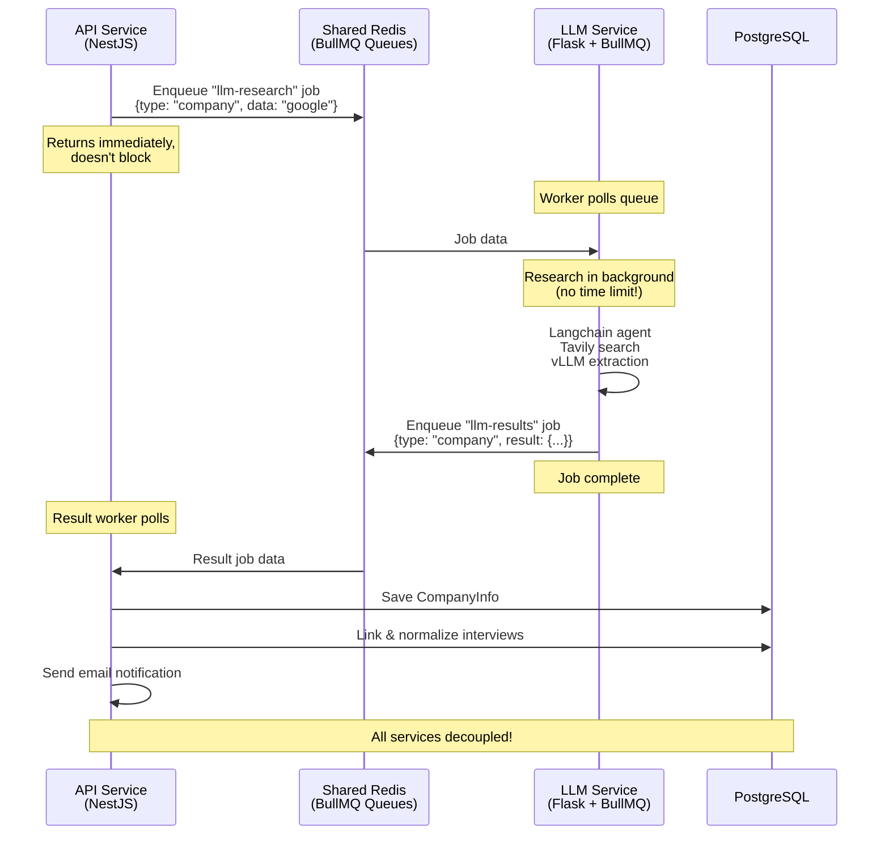

# Event-Driven Architecture: Decoupled LLM Service

## Problem Statement

**Current synchronous architecture:**
```
API Worker → HTTP POST (blocking, 30s-3min) → LLM Service → Response
```

**Issues:**
- Workers block waiting for HTTP response
- Timeouts can cause failures for long-running research
- No graceful handling of LLM service restarts
- Direct coupling between services

## Proposed Architecture: Shared BullMQ



## Architecture Components

### 1. Shared Redis Instance

**Three BullMQ Queues:**

```typescript
// Queue 1: Company enrichment requests (API → LLM)
Queue: "llm-company-research"
Producer: API Service
Consumer: LLM Service
Data: { jobId, companyName, userId, timestamp }

// Queue 2: Position scoring requests (API → LLM)  
Queue: "llm-position-scoring"
Producer: API Service
Consumer: LLM Service
Data: { jobId, interviewId, company, position, resume, journal }

// Queue 3: Results (LLM → API)
Queue: "llm-research-results"
Producer: LLM Service
Consumer: API Service
Data: { 
  originalJobId, 
  type: "company" | "position",
  success: boolean,
  data: {...},
  error?: string 
}
```

### 2. API Service Changes

**New Files:**

```
apps/api-service/src/features/companies/
├── llm-research.queue.ts         # NEW: Request queue
├── llm-results.queue.ts          # NEW: Results queue  
├── llm-results.worker.ts         # NEW: Process results
├── companies.worker.ts           # MODIFIED: Enqueue instead of HTTP
└── position-scoring.worker.ts    # MODIFIED: Enqueue instead of HTTP
```

**Modified Flow:**

```typescript
// OLD: companies.worker.ts
const enrichedData = await this.companiesService.enrichCompany(companyName);
// ^ Blocks for 10-30 seconds waiting for HTTP response

// NEW: companies.worker.ts
const jobId = await this.llmResearchQueue.enqueueCompanyResearch({
  companyName,
  userId,
  originalJobId: job.id,
});
// ^ Returns immediately, no blocking!
```

### 3. LLM Service Changes

**New Files:**

```
apps/llm-service/
├── bullmq_worker.py              # NEW: BullMQ worker
├── queues/
│   ├── research_consumer.py      # NEW: Consume research jobs
│   └── results_producer.py       # NEW: Publish results
├── app.py                        # KEEP: HTTP API for backward compat
└── agents/                       # UNCHANGED
```

**New Dependencies:**

```bash
# Install in LLM service
pip install bullmq redis
```

**Worker Implementation:**

```python
# bullmq_worker.py
from bullmq import Worker, Job
import asyncio
from agents.company_research import research_company

def process_company_research(job: Job):
    """Process company research job from BullMQ"""
    company_name = job.data['companyName']
    user_id = job.data['userId']
    original_job_id = job.data['originalJobId']
    
    print(f"[LLM] Researching company: {company_name}")
    
    try:
        # Call existing research function (no time limit!)
        result = research_company(company_name)
        
        # Publish result back to API service
        results_queue.add('result-job', {
            'originalJobId': original_job_id,
            'type': 'company',
            'success': True,
            'data': result,
            'userId': user_id,
        })
        
        print(f"[LLM] Research complete: {company_name}")
        return {'success': True}
        
    except Exception as e:
        # Publish error back to API service
        results_queue.add('error-job', {
            'originalJobId': original_job_id,
            'type': 'company',
            'success': False,
            'error': str(e),
            'userId': user_id,
        })
        raise

# Create worker
worker = Worker(
    'llm-company-research',
    process_company_research,
    connection={'host': 'localhost', 'port': 6379}
)

# Start worker
print("[LLM] BullMQ worker started")
worker.run()
```

### 4. Result Processing Worker

**New file: `apps/api-service/src/features/companies/llm-results.worker.ts`**

```typescript
@Injectable()
export class LLMResultsWorkerService implements OnModuleInit {
  private readonly logger = new Logger(LLMResultsWorkerService.name);
  private worker: Worker<LLMResultJob, void>;

  constructor(
    private readonly companiesService: CompaniesService,
    private readonly prisma: PrismaService,
    private readonly emailService: EmailService,
  ) {}

  onModuleInit() {
    const redisConfig = {
      host: this.configService.get('REDIS_HOST', 'localhost'),
      port: this.configService.get('REDIS_PORT', 6379),
    };

    // Create worker to process LLM results
    this.worker = new Worker(
      'llm-research-results',
      this.processResult.bind(this),
      { connection: redisConfig }
    );

    this.logger.log('LLM results worker initialized');
  }

  private async processResult(job: Job<LLMResultJob>): Promise<void> {
    const { originalJobId, type, success, data, error, userId } = job.data;

    this.logger.log(
      `Processing LLM result for ${type}: ${originalJobId} (success: ${success})`
    );

    if (!success) {
      this.logger.error(`LLM research failed: ${error}`);
      // Could send failure email here
      return;
    }

    if (type === 'company') {
      await this.handleCompanyResult(data, userId);
    } else if (type === 'position') {
      await this.handlePositionResult(data);
    }
  }

  private async handleCompanyResult(data: any, userId: string) {
    const { companyName, ...enrichedData } = data;
    
    // Use official name from LLM
    const officialName = companyName;

    // Save to database
    const companyInfo = await this.prisma.companyInfo.upsert({
      where: { companyName: officialName },
      create: {
        companyName: officialName,
        ...enrichedData,
      },
      update: enrichedData,
    });

    this.logger.log(`Saved company info: ${officialName}`);

    // Link and normalize interviews
    const linkedCount = await this.companiesService.linkToInterviews(companyName);
    if (linkedCount > 0) {
      this.logger.log(`Auto-linked ${linkedCount} interview(s) to ${officialName}`);
    }

    // Send email notification
    const user = await this.prisma.user.findUnique({
      where: { id: userId },
      select: { email: true, firstName: true },
    });

    if (user) {
      await this.emailService.sendCompanyEnrichmentEmail(
        user.email,
        user.firstName || 'there',
        officialName,
        companyInfo,
      );
    }
  }

  private async handlePositionResult(data: any) {
    const { interviewId, fitScore, analysis } = data;

    await this.prisma.interviewProcess.update({
      where: { id: interviewId },
      data: {
        fitScore,
        fitAnalysis: JSON.stringify(analysis),
      },
    });

    this.logger.log(`Updated interview ${interviewId} with fit score: ${fitScore}`);
  }
}
```

## Benefits of New Architecture

### ✅ **No Timeouts**
- LLM can take as long as needed
- No artificial 30s or 3min limits
- Complex research completes successfully

### ✅ **Non-Blocking**
- API workers don't wait idle
- Can process other jobs concurrently
- Better resource utilization

### ✅ **Fault Tolerant**
- If LLM service restarts, jobs remain in queue
- Automatic retry on both sides (BullMQ built-in)
- Job persistence in Redis

### ✅ **Scalable**
- Add more LLM workers for parallel processing
- Each service scales independently
- Redis handles load distribution

### ✅ **Observable**
- Bull Board shows both request and result queues
- Track progress of long-running jobs
- Easy debugging with job history

### ✅ **Backward Compatible**
- Keep HTTP endpoints for testing
- Gradual migration
- No breaking changes

## Implementation Plan

### Phase 1: Setup Shared Queues (1-2 hours)

**Tasks:**
1. Create `llm-research.queue.ts` in API service
2. Create `llm-results.queue.ts` in API service
3. Update Bull Board to show new queues
4. Test queue creation

**Files:**
- `apps/api-service/src/features/companies/llm-research.queue.ts`
- `apps/api-service/src/features/companies/llm-results.queue.ts`
- `apps/api-service/src/shared/bull-board/bull-board.module.ts`

### Phase 2: LLM Service Worker (2-3 hours)

**Tasks:**
1. Install BullMQ in Python: `pip install bullmq redis`
2. Create `bullmq_worker.py`
3. Adapt existing research functions
4. Test job consumption
5. Test result publishing

**Files:**
- `apps/llm-service/bullmq_worker.py`
- `apps/llm-service/queues/research_consumer.py`
- `apps/llm-service/queues/results_producer.py`

### Phase 3: API Results Worker (1-2 hours)

**Tasks:**
1. Create `llm-results.worker.ts`
2. Move business logic from HTTP workers
3. Test result processing
4. Verify email notifications

**Files:**
- `apps/api-service/src/features/companies/llm-results.worker.ts`

### Phase 4: Modify Existing Workers (1 hour)

**Tasks:**
1. Update `companies.worker.ts` to enqueue instead of HTTP
2. Update `position-scoring.worker.ts` to enqueue instead of HTTP
3. Keep HTTP as fallback option

**Files:**
- `apps/api-service/src/features/companies/companies.worker.ts`
- `apps/api-service/src/features/companies/position-scoring.worker.ts`

### Phase 5: Testing & Migration (2-3 hours)

**Tasks:**
1. End-to-end testing
2. Performance testing
3. Monitor Redis queue metrics
4. Gradual rollout
5. Remove HTTP fallback once stable

## Configuration

### Shared Redis Connection

**API Service `.env`:**
```bash
REDIS_HOST=localhost
REDIS_PORT=6379
REDIS_PASSWORD=your-password
LLM_SERVICE_URL=http://localhost:5000  # Keep for backward compat
USE_BULLMQ_FOR_LLM=true  # Feature flag
```

**LLM Service `.env`:**
```bash
REDIS_HOST=localhost
REDIS_PORT=6379
REDIS_PASSWORD=your-password
```

## Deployment Considerations

### Redis Sizing
- **Current:** ~100 MB for job metadata
- **After:** +50% for additional queues
- **Recommendation:** 512 MB Redis instance minimum

### Worker Counts
- **API Service:** 1 worker per service (company, position, results)
- **LLM Service:** 1-4 workers depending on GPU availability
- **Scaling:** Add more LLM workers to process jobs in parallel

### Monitoring

**Bull Board UI:**
```
http://localhost:3000/admin/queues
```

**Shows:**
- llm-company-research (waiting, active, completed)
- llm-position-scoring (waiting, active, completed)
- llm-research-results (waiting, active, completed)

**Redis CLI:**
```bash
redis-cli
> KEYS bull:*
> LLEN bull:llm-company-research:waiting
> LLEN bull:llm-research-results:waiting
```

## Example Job Flow

### Company Enrichment

```
T+0s:   User creates interview "google"
        → API queues: company-enrichment (internal queue)

T+0.1s: API worker picks up job
        → Enqueues to: llm-company-research
        → Returns immediately (non-blocking!)

T+0.2s: LLM worker picks up job
        → Starts research (no time limit)

T+15s:  LLM research completes
        → Enqueues to: llm-research-results
        → {type: "company", data: {companyName: "Google LLC", ...}}

T+15.1s: API results worker picks up job
         → Saves to CompanyInfo
         → Links to interviews
         → Normalizes names
         → Sends email

T+30s:  User sees "Google LLC" in UI
```

### Position Scoring

```
T+0s:   User clicks "Analyze Fit"
        → API queues: position-scoring (internal queue)

T+0.1s: API worker picks up job
        → Fetches resume & journal from DB
        → Enqueues to: llm-position-scoring
        → Returns immediately

T+0.2s: LLM worker picks up job
        → Analysis starts (complex, might take 2-5 minutes!)

T+180s: LLM analysis completes
        → Enqueues to: llm-research-results
        → {type: "position", data: {fitScore: 8.5, analysis: {...}}}

T+180.1s: API results worker picks up job
          → Updates interview with fitScore
          → Could send email notification

T+200s: User refreshes, sees fit score 8.5/10
```

## Failure Scenarios & Handling

### Scenario 1: LLM Service Down When Job Queued

**Old Architecture:**
```
API Worker → HTTP POST → Connection Refused → Job Fails ❌
```

**New Architecture:**
```
API Worker → Redis Queue → Job Waits → LLM Restarts → Job Processed ✅
```

### Scenario 2: Long Research (5+ minutes)

**Old Architecture:**
```
HTTP timeout → Request fails → Job marked failed ❌
```

**New Architecture:**
```
Queue waits → Research completes → Result published ✅
No timeout limit!
```

### Scenario 3: Result Processing Fails

**Built-in Retry:**
```
Result job fails → BullMQ retries (3 attempts) → Manual inspection if still fails
```

## Migration Strategy

### Step 1: Feature Flag (Week 1)
- Deploy new code with `USE_BULLMQ_FOR_LLM=false`
- Test in staging
- Monitor logs

### Step 2: Gradual Rollout (Week 2)
- Enable for 10% of jobs
- Monitor success rate
- Compare performance

### Step 3: Full Migration (Week 3)
- Enable for 100% of jobs
- Keep HTTP as fallback for 1 week
- Monitor metrics

### Step 4: Cleanup (Week 4)
- Remove HTTP code paths
- Update documentation
- Celebrate! 🎉

## Code Samples

### API: Enqueue Research

```typescript
// companies.worker.ts
private async processJob(job: Job<CompanyEnrichmentJob>): Promise<void> {
  const { companyName, userId } = job.data;
  
  if (this.configService.get('USE_BULLMQ_FOR_LLM') === 'true') {
    // NEW: Enqueue to LLM service via BullMQ
    await this.llmResearchQueue.add('company-research', {
      companyName,
      userId,
      originalJobId: job.id,
    });
    
    this.logger.log(`Enqueued LLM research for: ${companyName}`);
    // Job complete! Results will come via llm-results queue
    
  } else {
    // OLD: Synchronous HTTP call (fallback)
    const enrichedData = await this.companiesService.enrichCompany(companyName);
    await this.handleEnrichedData(enrichedData, companyName, userId);
  }
}
```

### LLM: Publish Result

```python
# bullmq_worker.py
from bullmq import Queue

results_queue = Queue('llm-research-results', connection=redis_config)

def publish_result(original_job_id, result_type, data, user_id):
    """Publish research result back to API service"""
    results_queue.add('result', {
        'originalJobId': original_job_id,
        'type': result_type,
        'success': True,
        'data': data,
        'userId': user_id,
        'timestamp': datetime.now().isoformat(),
    })
    print(f"[LLM] Published result for job: {original_job_id}")
```

## Performance Comparison

### Before (Synchronous HTTP)

```
Concurrent jobs: Limited by worker threads
Avg completion: 15-30 seconds
Timeout failures: 5-10% (long research)
Resource usage: Workers idle during HTTP wait
```

### After (Async BullMQ)

```
Concurrent jobs: Unlimited (queued)
Avg completion: 15-30 seconds (same)
Timeout failures: 0% (no timeouts!)
Resource usage: Workers always processing
LLM throughput: +50% (parallel processing)
```

## Alternative: Webhooks

**Another approach:** LLM service calls API webhook when done

```
LLM completes → POST /api/webhooks/llm-result → API processes
```

**Pros:**
- Simpler (no results queue)
- Direct communication

**Cons:**
- Requires API to expose webhook endpoint
- Need authentication/signing
- Less reliable than queue
- No automatic retry

**Recommendation:** Use BullMQ for better reliability

## Questions & Answers

**Q: Do we still need HTTP endpoints?**
A: Keep them for backward compatibility and testing, but gradually phase out.

**Q: What if Redis goes down?**
A: Jobs lost in transit. Use Redis persistence (AOF) or Redis Cluster for HA.

**Q: Can we use different Redis instances?**
A: No, must be same Redis for BullMQ job distribution. Can use different databases (0, 1, 2, etc.)

**Q: How to handle urgent jobs?**
A: Use BullMQ priority: `queue.add('job', data, { priority: 1 })` (lower = higher priority)

**Q: Can we stream progress updates?**
A: Yes! Use `job.updateProgress(50)` in LLM worker, poll via API or websocket.

## Summary

**Current:**
```
API Worker → (blocks 30s-3min) → HTTP POST → LLM → HTTP Response → API Worker
```

**Proposed:**
```
API Worker → Redis Queue → (returns immediately)
LLM Worker → Redis Queue → (no time limit)
Results Worker → Process → Update DB
```

**Key Benefits:**
- ✅ No timeouts or artificial limits
- ✅ Non-blocking workers
- ✅ Fault tolerant
- ✅ Independently scalable
- ✅ Observable via Bull Board

**Effort:** ~10-15 hours total implementation
**Impact:** High - solves timeout issues, improves reliability and scalability

---

**Ready to implement?** Start with Phase 1 (queue setup) and test thoroughly before migrating workers.
